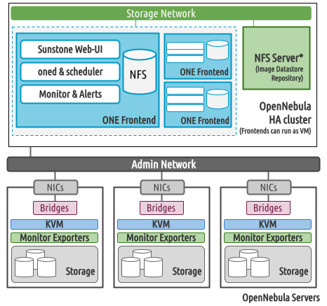

[//]: # ( vim: set wrap : )

# Highly-available Front-end

## Architecture

To deploy OpenNebula Front-ends in High Availability (HA) mode, you need at least three Front-ends, the minimum odd number to reach consensus. For these servers you will need to consider:

* The Front-ends can run as Virtual Machines (VMs). In this case you need to provision them directly from libvirt/QEMU or any other virtualization platform.
* The OpenNebula services will be reached through a Virtual IP (VIP). This IP will float to the active leader automatically.
* This configuration is compatible with any storage configuration, [shared](arch_single_shared) or [local](arch_single_local).
* The Front-ends will need to share the image repository. You need to mount the NFS share, then include the mount point in the inventory file as described in the [shared](arch_single_shared) or [local](arch_single_local) guides.

<p align="center">

</p>

## Ansible Role

The `opennebula/server` role is capable of managing multiple, clustered OpenNebula Front-end machines. Each such machine is simply added to the built-in **Zone 0** of OpenNebula.

```
root@n1a1:~# onezone show 0
ZONE 0 INFORMATION
ID                : 0
NAME              : OpenNebula
STATE             : ENABLED


ZONE SERVERS
ID NAME            ENDPOINT
 0 n1a1            http://n1a1:2633/RPC2
 1 n1a2            http://n1a2:2633/RPC2
 2 n1a3            http://n1a3:2633/RPC2

HA & FEDERATION SYNC STATUS
ID NAME            STATE      TERM       INDEX      COMMIT     VOTE  FED_INDEX
 0 n1a1            leader     1          263        263        0     -1
 1 n1a2            follower   1          263        263        0     -1
 2 n1a3            follower   1          263        263        0     -1

ZONE TEMPLATE
ENDPOINT="http://localhost:2633/RPC2
```

## Deploying

To deploy a cluster, it's enough to provide the VIP configuration and multiple Front-end machines in the inventory file:

```yaml
all:
  vars:
    one_vip: 10.2.50.86
    one_vip_cidr: 24
    one_vip_if: eth0
```

```yaml
frontend:
  hosts:
    n1a1: { ansible_host: 10.2.50.10 }
    n1a2: { ansible_host: 10.2.50.11 }
    n1a3: { ansible_host: 10.2.50.12 }
```

> [!NOTE]
> For HA mode to work, all of the `one_vip*` parameters are strictly required, i.e. inside the *Leader* Front-end you will *always* find:

```
root@n1a1:~# ip address show eth0
2: eth0: <BROADCAST,MULTICAST,UP,LOWER_UP> mtu 1500 qdisc fq_codel state UP group default qlen 1000
    inet 10.2.50.10/24 brd 10.2.50.255 scope global eth0
       valid_lft forever preferred_lft forever
    inet 10.2.50.86/24 scope global secondary eth0
       valid_lft forever preferred_lft forever
```

## Scaling

If you would like to deploy only a single Front-end, but still make it HA-ready, you can specify the `force_ha` parameter.

```yaml
all:
  vars:
    force_ha: true
```

```yaml
frontend:
  hosts:
    n1a1: { ansible_host: 10.2.50.10 }
```

Later, when you decide to implement true HA, you can simply increase the number of Front-end machines and re-run the automation:

```yaml
frontend:
  hosts:
    n1a1: { ansible_host: 10.2.50.10 }
    n1a2: { ansible_host: 10.2.50.11 }
    n1a3: { ansible_host: 10.2.50.12 }
```

> [!NOTE]
> Conversion from non-HA to HA is not implemented in this automation, please plan ahead!

> [!NOTE]
> We support scaling **UP** only, as the reverse operation seems to be uncommon (you can still do it manually).

## RSYNC/SSH keys

It's important to mention that adding extra Front-end machines requires synchronization of the OpenNebula Database and the `/var/lib/one/{.one,.ssh}/` folders. This is performed automatically, but requires password-less login to enable Ansible to use `rsync` or `ssh` to copy all required files from the Leader directly to new Followers. To can generate SSH keys with `ssh-agent`, provide them manually, or generate them automatically by using the `ensure_keys_for` parameter:

```yaml
all:
  vars:
    ansible_user: ubuntu
    ensure_keys_for: [ubuntu]
```
