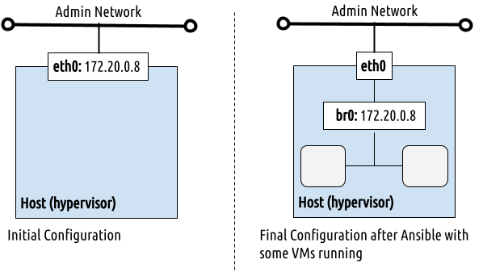

[//]: # ( vim: set wrap : )

# Deploying a Single Front-end & Local Storage

In this architecture, a single Front-end runs all of the OpenNebula services, and the Virtual Machines (VMs) run on Hypervisor hosts. VM images are hosted in the Front-end, and transferred to the Hypervisor nodes as needed.

The Front-end and hypervisors are in the same flat (bridged) network.

This page briefly describes each component of the architecture and lists the corresponding configuration for automatic deployment.

For a step-by-step tutorial on deploying on this architecture, please see the [OpenNebula documentation](https://docs.opennebula.io/stable/installation_and_configuration/automatic_deployment/one_deploy_tutorial_local_ds.html).

[[images/arch_local.png|Single Front-end with local storage]]

## Storage

The Front-end hosts the image repository that contains the virtual disk images. When a Virtual Machine is instantiated, the Front-end transfers a copy of the virtual disk image to the Hypervisor node that will run the VM. By default, both the Front-end and Hypervisor nodes store these images in the directory `/var/lib/one/datastores`. This can be an actual directory on the root filesystem, or a symlink to any other location.

### Configuring the Automatic Deployment

#### Datastore Mode

To use the default location (/var/lib/one/datastores as a real directory on the root filesystem), the inventory file for the deployment should contain the following snippet:

```
ds:
   mode: ssh
```

#### Storage Volumes

If you wish to use a dedicated volume for the datastores, you can mount it at `/var/lib/one/datastores` prior to the deployment.

To use a dedicated volume mounted at a custom location (e.g. `/mnt/one_datastores`), then you need to pre-create directories for each datastore, and assign the oneadmin system user as owner. In the inventory file use the following snippet, which will automatically create the symlinks during the deployment:

```
ds:

  mode: ssh
  mounts:
  - type: system
    path: /mnt/one_datastores/system/
  - type: image
    path: /mnt/one_datastores/default/
  - type: files
    path: /mnt/one_datastores/files/
```

The resulting directory structure on each host is shown below:

Deployed to the default location:

```
$ tree /var/lib/one/datastore/
/var/lib/one/datastores/
├── 0 -> /mnt/one_datastores/system/
├── 1 -> /mnt/one_datastores/default/
└── 2 -> /mnt/one_datastores/files/
```

Deployed to a custom location, in this case `/mnt/one_datastores/`:

```
$ tree /mnt/one_datastores/
/mnt/one_datastores/
├── system
├── default
└── files
```

## Networking

This deployment uses the most basic network configuration, a flat (bridged) network. Each host uses its main network interface to connect to the VMs on the network.

> [! NOTE]
> To perform the initial configuration, the playbooks require Netplan or NetworkManager on all the nodes.

The image below shows the interfaces used in this deployment:



This configuration requires enough available IPs for the VMs that will be deployed. These IPs must be reachable via the main interface on the host, since this interface will be used to forward traffic to the VMs.

The snippet below defines a virtual network, using a range of IPs available in the `admin_net` network used by the nodes.

```yaml
vn:
  admin_net:
    managed: true
      template:
        VN_MAD: bridge
        PHYDEV: eth0
        BRIDGE: br0
        AR:
          TYPE: IP4
          IP: 10.0.0.50
          SIZE: 48
        NETWORK_ADDRESS: 10.0.0.0
        NETWORK_MASK: 255.255.255.0
        GATEWAY: 10.0.0.1
        DNS: 1.1.1.1
```

When defining the network, you can use any interface on the hosts. For example, to define a dedicated network for the VMs, using interface `bond0` and VXLAN networking:

```yaml
vn:
  vms_net:
    managed: true
    template:
      VN_MAD: vxlan
      PHYDEV: bond0
      BRIDGE: br1
      VLAN_ID: 123
      FILTER_IP_SPOOFING: 'NO'
      FILTER_MAC_SPOOFING: 'YES'
      GUEST_MTU: 1450
      AR:
        TYPE: IP4
        IP: 192.168.0.10
        SIZE: 100
      NETWORK_ADDRESS: 192.168.0.0
      NETWORK_MASK: 255.255.255.0
      GATEWAY: 192.168.0.1
      DNS: 192.168.0.1
```

## OpenNebula Front-end & Services

The Ansible playbook installs a complete suite of OpenNebula services including the base daemons (`oned` and scheduler), the OpenNebula Flow and Gate services, and Sunstone web UI. You can simply select the OpenNebula version to install and pick a password for the `oneadmin` user:

```yaml
all:
  vars:
    one_pass: opennebula
    one_version: '6.10'
```

## Sunstone UI

The Sunstone Server can be deployed as a SystemD service (`opennebula-sunstone`) or, for improved performance, on top of the [Phusion Passenger](https://www.phusionpassenger.com/docs/tutorials/what_is_passenger/) Apache2 module. For more information about this integration, please see the [documentation](https://docs.opennebula.io/stable/installation_and_configuration/large-scale_deployment/sunstone_for_large_deployments.html). Apache2 is not configured by default, you can enable it by defining few inventory variables:

```yaml
all:
  vars:
    features:
      # Enable Passenger/Apache2 integration.
      passenger: true
    apache2_http:
      # Do NOT manage (or deploy) plain HTTP Apache2 VHOST.
      managed: false
    apache2_https:
      # Do manage and deploy HTTPS Apache2 VHOST.
      managed: true
      # NOTE: The key and certchain vars should point to existing and valid PEM files.
      key: /etc/ssl/private/opennebula-key.pem
      certchain: /etc/ssl/certs/opennebula-certchain.pem
    # Access your instance at https://myone.example.org.
    one_fqdn: myone.example.org
```

> [!NOTE]
> When Passenger integration is enabled, the `opennebula-sunstone` SystemD service is automatically stopped and disabled.

## Using Your Enterprise Edition

You can use your enterprise distribution with the Ansible playbooks. Simply add your token to the var file:

```yaml
all:
  vars:
    one_token: example:example
```

## Sample Complete Inventory File for Local Storage

The following file shows the complete settings to install a single Front-end with two hosts using local storage:

```yaml
---
all:
  vars:
    ansible_user: root
    one_version: '6.6'
    one_pass: opennebulapass
    ds:
      mode: ssh
    vn:
      admin_net:
        managed: true
        template:
          VN_MAD: bridge
          PHYDEV: eth0
          BRIDGE: br0
          AR:
            TYPE: IP4
            IP: 172.20.0.100
            SIZE: 48
          NETWORK_ADDRESS: 172.20.0.0
          NETWORK_MASK: 255.255.255.0
          GATEWAY: 172.20.0.1
          DNS: 1.1.1.1

frontend:
  hosts:
    fe1: { ansible_host: 172.20.0.7 }

node:
  hosts:
    node1: { ansible_host: 172.20.0.8 }
    node2: { ansible_host: 172.20.0.9 }
```

The table below lists some of the parameters, which you should update to your own deployment:

| Parameter      | Description
|----------------|------------------------------------------------------------------------------------------------|
| `one_version`  | The version of OpenNebula to install.                                                          |
| `ansible_user` | The user that will run the Ansible playbook.                                                   |
| `one_pass`     | Password for the OpenNebula user `oneadmin`.                                                   |
| `vn`           | Definition of the OpenNebula virtual network ("`admin_net`") that will be created for the VMs. |
| `PHYDEV`       | The physical interface on the servers that will attach to the virtual to the virtual network.  |
| `AR`           | Address range (first IP and size) to assign to the VMs.                                        |
| `GATEWAY`      | Default gateway for the network.                                                               |
| `DNS`          | DNS server for the network.                                                                    |
| `f1`,`n1`,`n2` | `ansible_host` IP addresses for the Front-end (`n1`) and Hypervisors (`n1` and `n2`).          |

## Running the Ansible Playbook

For complete information on running the playbooks, please see [Using the Playbooks](sys_use).

To run the playbook, follow these basic steps:

1. **Prepare the inventory file**, adapting it to your needs. For example, update the provided `local.yml` file to match your infrastructure settings.

2. **Check the connection** between the Ansible control node and the managed nodes. You can verify the network connection, ssh and sudo configuration with the following command:
```shell
ansible -i inventory/local.yml all -m ping -b
```
3. **Run the playbook**, for example from the `one-deploy` directory with the below command:
```shell
ansible-playbook -i inventory/local.yml opennebula.deploy.main
```
After execution of the playbook is finished, your new OpenNebula cloud is ready. You can check the installation by following the [Verification guide](sys_verify).
