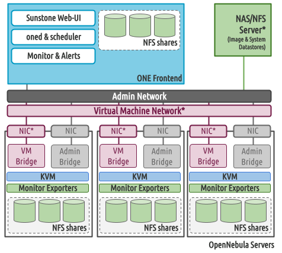

[//]: # ( vim: set wrap : )

# Single Front-end & Shared Storage

This scenario is a variation of the [local storage](arch_single_local) setup. Here, the storage for virtual machines (VMs) and the image repository are provided by a NFS/NAS server. Running VMs directly from shared storage can enhance the fault tolerance of the system in the event of a host failure, although it comes with the drawback of increased I/O latency.

<p align="center">

</p>

> [!NOTE]
> The playbook assumes that you have already configured and mounted the NFS shares in all the servers.

## Storage

### NFS server configuration

The NFS/NAS server is configured to export the datastore folders to the hosts in the OpenNebula cloud. In this example we assume that the following structure is created in the NFS/NAS sever:

```
root@nfs-server:/# ls -ln /srv
total 0
drwxr-xr-x 2 9869 9869 6 Jun 26 17:55 0
drwxr-xr-x 2 9869 9869 6 Jun 26 17:55 1
drwxr-xr-x 2 9869 9869 6 Jun 26 17:55 2
```

> [!IMPORTANT]
> The ownership of the folders **MUST** be 9869 as this is the UID/GID assigned to the `oneadmin` account during the installation.


> [!IMPORTANT]
> The files & kernels datastore (folder `/srv/2`, in the example) will be only mounted in the front-end; hosts will always use local storage for this datastore.

This folder is exported to the OpenNebula servers, for example:

```shell
# /etc/exports
#
# See exports(5) for more information.
#
# Use exportfs -r to reread
# /export	192.168.1.10(rw,no_root_squash)
/srv 172.20.0.0/24(rw,soft,intr,async)
```
**After running the playbook** you will see the following set up in the front-end:
```
root@ubuntu2204-17:~# ls -l /var/lib/one/datastores/
total 4
lrwxrwxrwx 1 root     root        7 Jun 27 11:12 1 -> /mnt/1/
drwxr-xr-x 2 oneadmin oneadmin 4096 Jun 27 11:09 2
```

### NFS client configuration

In this example all servers (front-end and hosts) mounts the NFS shared under the `/mnt` folder:
```
root@ubuntu2204-17:/# ls -la /mnt/
total 4
drwxr-xr-x  5 root root   33 Jun 26 15:58 .
drwxr-xr-x 18 root root 4096 Jun 27 09:30 ..
drwxr-xr-x  2 9869 9869    6 Jun 26 15:55 0
drwxr-xr-x  2 9869 9869    6 Jun 26 15:55 1
drwxr-xr-x  2 9869 9869    6 Jun 26 15:55 2
```

**After running the playbook** you will see the following set up in the hosts:
```
root@ubuntu2204-18:~# ls -l /var/lib/one/datastores/
total 0
lrwxrwxrwx 1 root root 7 Jun 27 11:10 0 -> /mnt/0/
lrwxrwxrwx 1 root root 7 Jun 27 11:10 1 -> /mnt/1/
```

### Inventory

The following snippet shows the configuration required to use the `shared` storage using the above mount points:

```yaml
ds:
  mode: shared
  config:
    mounts:
    - type: system
      path: /mnt/0
    - type: image
      path: /mnt/1
    - type: file
      path: /mnt/2
```

> [!NOTE]
> File (`/mnt/2`) will only be symlinked in the front-end

## Networking

To [configure the network you can follow the local storage scenario section.](arch_single_local#networking)

## OpenNebula Front-end & Services

To [configure the front-end services](arch_single_local#opennebula-front-end--services) or using your [enterprise edition token](arch_single_local#enterprise-edition) you can follow the local storage scenario sections.

## The complete inventory file

The following file show the complete settings to install a single front-end with two hosts using shared storage:

```yaml
---
all:
  vars:
    ansible_user: root
    one_version: '6.6'
    one_pass: opennebulapass
    ds:
      mode: shared
      config:
        mounts:
        - type: system
          path: /mnt/0
        - type: image
          path: /mnt/1
        - type: file
          path: /mnt/2
    vn:
      admin_net:
        managed: true
        template:
          VN_MAD: bridge
          PHYDEV: eth0
          BRIDGE: br0
          AR:
            TYPE: IP4
            IP: 172.20.0.100
            SIZE: 48
          NETWORK_ADDRESS: 172.20.0.0
          NETWORK_MASK: 255.255.255.0
          GATEWAY: 172.20.0.1
          DNS: 1.1.1.1

frontend:
  hosts:
    f1: { ansible_host: 172.20.0.6 }

node:
  hosts:
    n1: { ansible_host: 172.20.0.7 }
    n2: { ansible_host: 172.20.0.8 }
```

## Running the Ansible Playbook

* **1. Prepare the inventory file**: Update the `shared.yml` file in the inventory file to match your infrastructure settings. Please be sure to update or review the following variables:
  - `ansible_user`, update it if different from root.
  - `one_pass`, change it to the password for the oneadmin account
  - `one_version`, be sure to use the latest stable version here

* **2. Check the connection**: Verify the network connection, ssh and sudo configuration run the following command:
```shell
ansible -i inventory/shared.yml all -m ping -b
```
* **3. Site installation**: Now we can run the site playbook that install and configure OpenNebula services
```shell
ansible-playbook -i inventory/shared.yml opennebula.deploy.main
```
Once the execution of the playbook finish your new OpenNebula cloud is ready. [You can now head to the verification guide](sys_verify).
